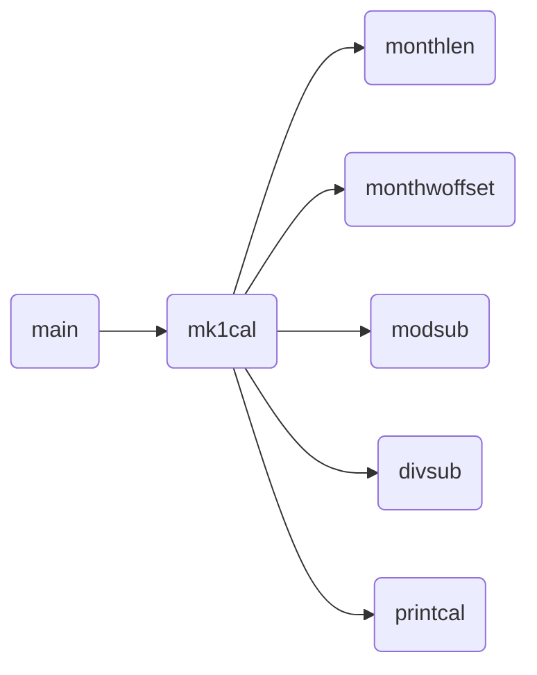
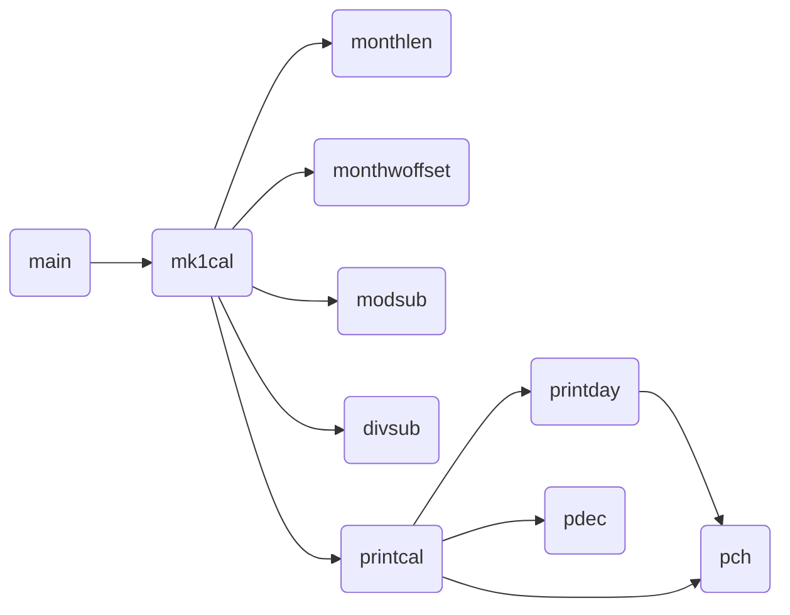

# コンピュータハードウェアII カレンダー

4405 井下颯力

## 作業1

こちらの作業で作成したソースコードは`1`ディレクトリに置かれている。
同梱の`cal.sh`を以下のように実行することでコンパイルと実行を同時に行うことができる。

```bash
./cal.sh y m
```

例として、2023年11月のカレンダーを表示するよう実行すると以下のように日曜始まりの1ヶ月分のカレンダーが表示される。

```bash
$ ./cal.sh 2023 11

          1  2  3  4
 5  6  7  8  9 10 11
12 13 14 15 16 17 18
19 20 21 22 23 24 25
26 27 28 29 30

```

このソースコードでのコールグラフを以下の図1に示す。



**図1**: 作業1における関数のコールグラフ

main関数、printcal関数のみC言語内の関数である。printcal関数はカレンダーを出力する処理を担っている。
mk1cal関数はさまざまな関数を駆使してカレンダーの日にちを計算し、カレンダーを出力する役割である。
以下はmk1calで用いられている関数だが、monthlenは月の日数を求める関数である。
monthwoffsetはツェラーの公式を活用して月の初日を求める関数である。
modsub、divsubはそれぞれ剰余、商を求める関数である。

## 作業2(a)(b)(c)

こちらの作業で作成したソースコードは`2-abc`ディレクトリに置かれている。
同梱の`cal.sh`を以下のように実行することでコンパイルと実行を同時に行うことができる。

```bash
./cal.sh y m
```

例として、2023年12月のカレンダーを表示するよう実行すると以下の要件を満たしたカレンダーが表示される

- 年、月、曜日表示
- 月曜始まり
- 横に3ヶ月分表示
- 年が変わった(13月になった)場合自動で年を計算して表示

```bash
$ ./cal.sh 2023 12
       2023 12                2024 1                2024 2
Mo Tu We Th Fr Sa Su  Mo Tu We Th Fr Sa Su  Mo Tu We Th Fr Sa Su
             1  2  3   1  2  3  4  5  6  7            1  2  3  4
 4  5  6  7  8  9 10   8  9 10 11 12 13 14   5  6  7  8  9 10 11
11 12 13 14 15 16 17  15 16 17 18 19 20 21  12 13 14 15 16 17 18
18 19 20 21 22 23 24  22 23 24 25 26 27 28  19 20 21 22 23 24 25
25 26 27 28 29 30 31  29 30 31              26 27 28 29
```

このソースコードでのコールグラフを以下の図1に示す。



**図1**: 作業2(a)(b)(c)おける関数のコールグラフ

作業1で使用した関数に加え、printday関数、pch関数、pdec関数が追加されている。
これらはそれぞれ、曜日を出力する関数、それを実現するために使用する、整数を表示する関数、年月を表示する際に使用する、整数を表示する関数である。
それ以外の関数は作業1と同様である。

## 作業2(d)

こちらの作業で作成したソースコードは`2-d`ディレクトリに置かれている。同梱の`cal.sh`を以下のように実行することでコンパイルと実行を同時に行うことができる。

```bash
./cal.sh y m n
```

例として、2023年12月から6ヶ月分のカレンダーを表示するよう実行すると、指定した月分のカレンダーが縦並びで表示される。尚、こちらは日曜始まりで年月曜日の表示は実装していない。

```bash
$ ./cal.sh 2023 12 6
                1  2
 3  4  5  6  7  8  9
10 11 12 13 14 15 16
17 18 19 20 21 22 23
24 25 26 27 28 29 30
31
    1  2  3  4  5  6
 7  8  9 10 11 12 13
14 15 16 17 18 19 20
21 22 23 24 25 26 27
28 29 30 31

             1  2  3
 4  5  6  7  8  9 10
11 12 13 14 15 16 17
18 19 20 21 22 23 24
25 26 27 28 29

                1  2
 3  4  5  6  7  8  9
10 11 12 13 14 15 16
17 18 19 20 21 22 23
24 25 26 27 28 29 30
31
    1  2  3  4  5  6
 7  8  9 10 11 12 13
14 15 16 17 18 19 20
21 22 23 24 25 26 27
28 29 30

          1  2  3  4
 5  6  7  8  9 10 11
12 13 14 15 16 17 18
19 20 21 22 23 24 25
26 27 28 29 30 31

```

このソースコードでのコールグラフを以下の図1に示す。


**図3**: 作業2(d)おける関数のコールグラフ

使用している関数は作業1と同様である。
